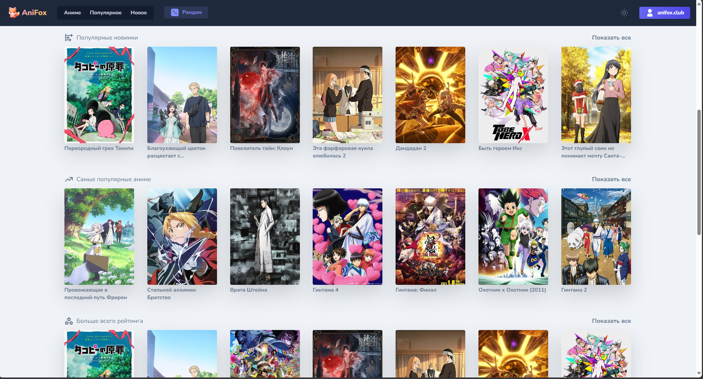
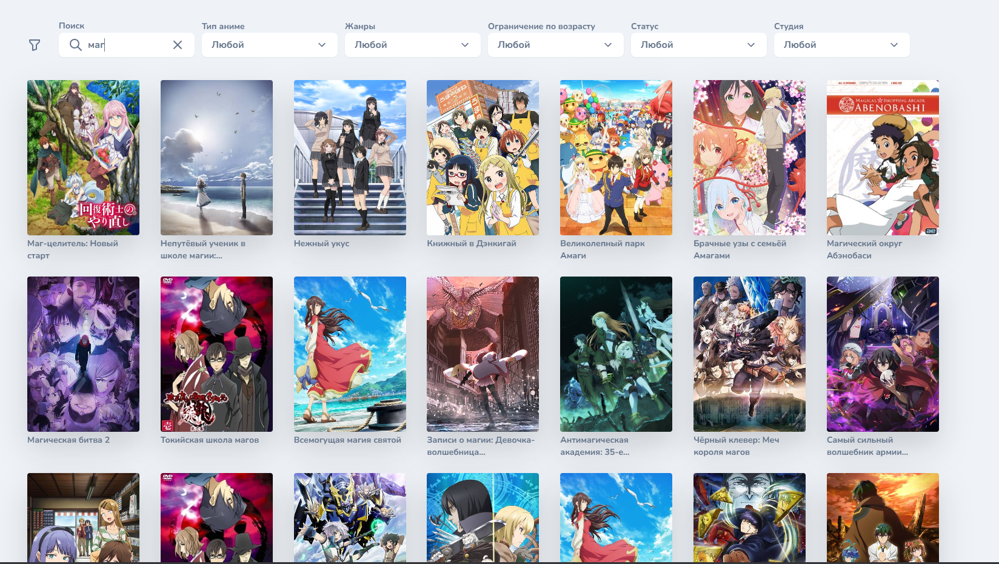
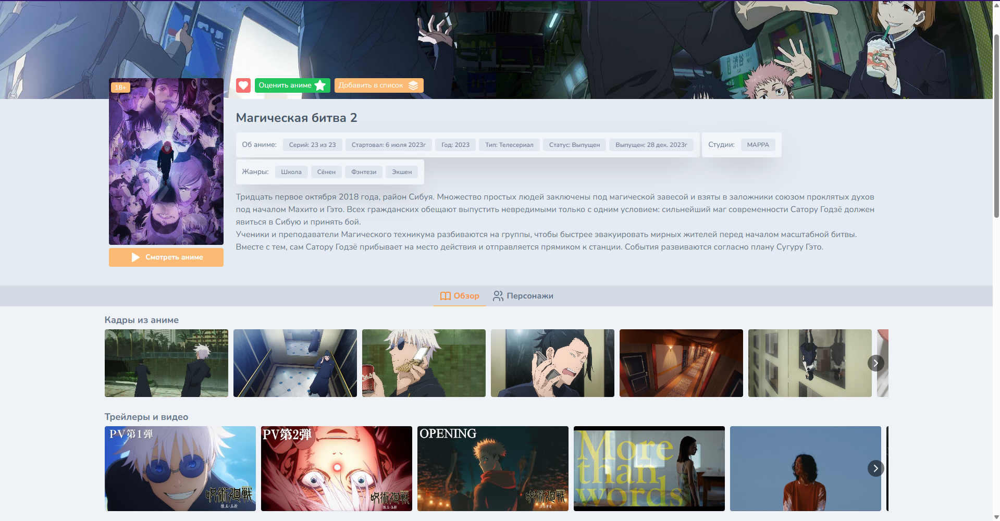
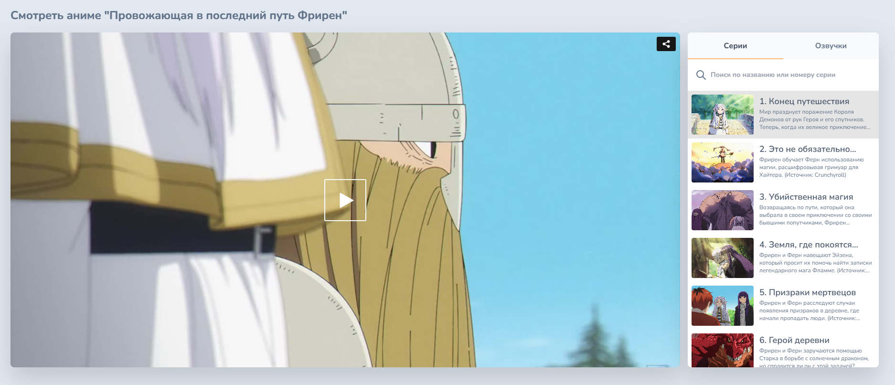
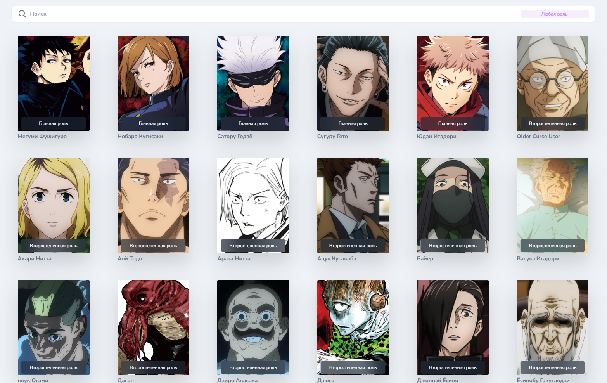
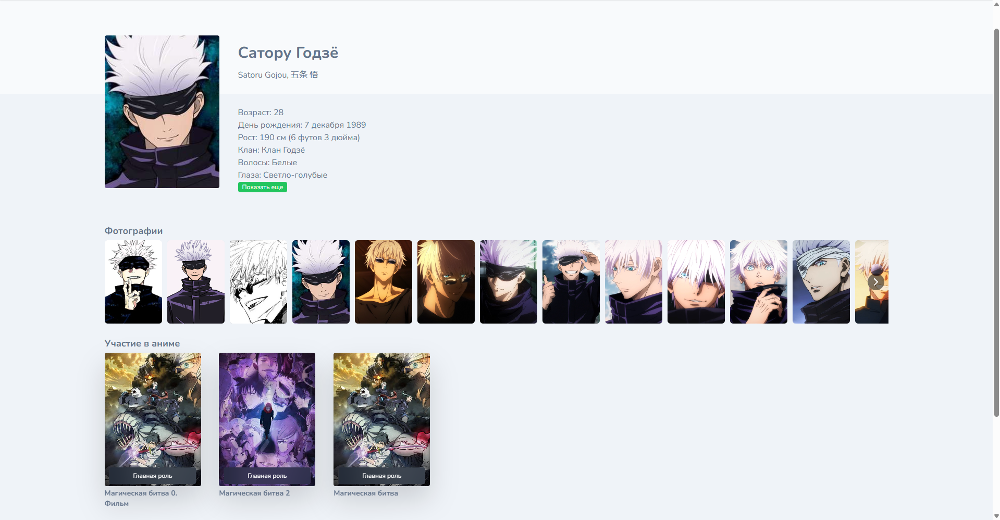
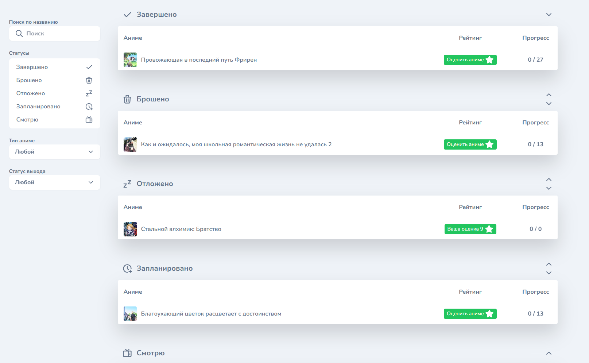
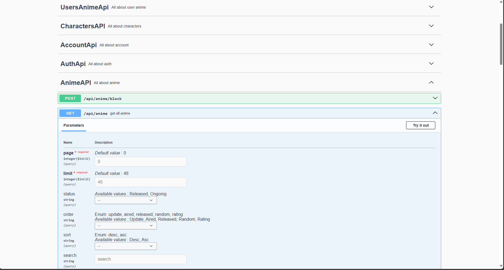
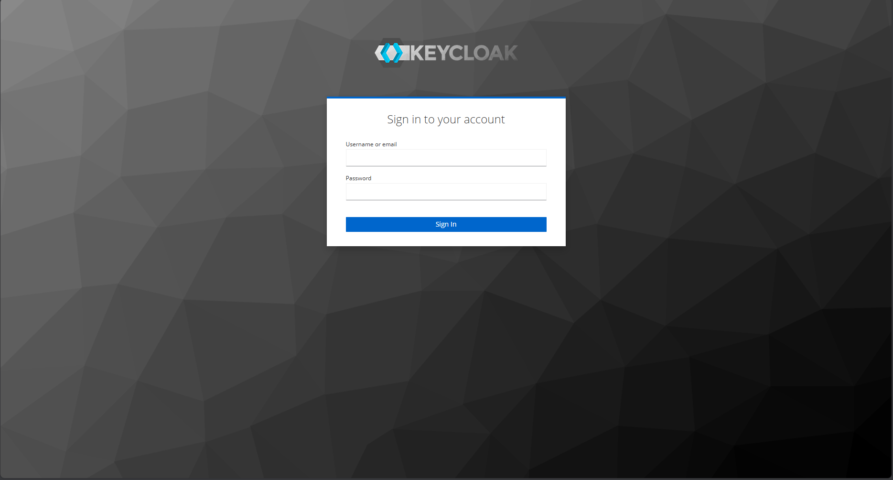

**Anifox** is a anime project where people can watch anime. **Open source project** made with ❤️.

## About
**Anifox** is an open-source anime watching platform built with ❤️, designed to provide an ad-free experience for anime enthusiasts. This repository contains the backend of the second, completely rewritten version of the Anifox project, initially developed as a diploma project. Explore the live application on [anifox.su](https://anifox.su)!

## Features
- **Anime Parsing**: Scheduled tasks in Spring Boot fetch new anime data from Shikimori, Jikan, Kitsu, Haglund, and Kodik every 12 hours, stored in a PostgreSQL database. ✅
- **Episode Updates**: Hourly scheduled tasks retrieve new anime episodes and metadata from Kodik, Kitsu, and Jikan. ✅
- **Anime Catalog**: Supports main catalog requests, anime details, and more. ✅
- **Anime Characters**: Find out all about your favorite anime character. ✅
- **Anime Voice Acting**: Watch anime with any of the popular dubbings (JAM, KANSAI Studio, AniDub, AniLibria, Studio Band, Animedia, SHIZA Project, HDrezka Studio, AniMaunt, Amber, Dream Cast). ✅
- **OAuth 2.0 Authentication**: Secure user authentication via Keycloak, integrated with the Spring Boot backend (cookie-based). ✅
- **User Features**: Rate anime and add to personal lists (Watching, Watched, Planned, Postponed), saving the point where playback stopped. ✅
- **Admin Features**: Block specific anime from appearing in user searches. ✅
- **Release Schedules**: Display upcoming anime release schedules. ✅
## Screenshots

### Home Page


### Search


### Anime Detail


### Watching Anime


### Characters List


### Character Detail


### Favourites


### Swagger UI


### Keycloak Integration


## API Documentation
API is documented using Springdoc. After running the app, access Swagger UI at `http://localhost:{API PORT}/springdoc/v3/swagger-ui/index.html`.
(Before that, you need to create an account in keycloak with an administrator role)

## Configuration
The AniFox backend requires environment variables to connect to external services, databases, and authentication systems.
````
anime.ko.token=<Kodik API token>;
bucket_name_s3=<Amazon S3 bucket name>;
secret_key_s3=<Amazon S3 secret access key>
domain_s3=<Amazon S3 CDN URL (e.g., https://cdn.domain)>;
spring.datasource.url=<JDBC URL to PostgreSQL (e.g., jdbc:postgresql://localhost:5432/anifox)>;
spring.datasource.username=<PostgreSQL username>;
spring.datasource.password=<PostgreSQL password>;
keycloak.auth-server-url=<Keycloak authentication server URL (e.g., https://keycloak)>;
keycloak.realm=<Keycloak realm name>;
keycloak.resource=<Keycloak client ID>;
keycloak.credentials.secret=<Keycloak client secret>;
keycloak.issuer-uri=<Keycloak realm issuer URL (e.g., https://keycloak/realms/realm-name)>;
key-store=<Path to keystore file (e.g., /path/to/keystore.jks)>;
key-store-password=<Keystore password>;
trust-store=<Path to truststore file (e.g., /path/to/truststore.jks)>;
trust-store-password=<Truststore password>;
spring.profiles.active=<Active profile (e.g., parser, prod, dev)>;
````

## Requirements
- JDK 17 or higher
- PostgreSQL 13+
- Keycloak server
- Docker (optional for containerized deployment)
- API tokens for external services (Kodik, etc.)

## Built With 🛠
- [Kotlin](https://kotlinlang.org/) - Modern programming language for happier developers.
- [Spring Boot](https://spring.io/projects/spring-boot) - Java framework for simplified application development.
- [Ktor Client](https://ktor.io/docs/welcome.html) - For client-side HTTP requests.
- [Kotlin Coroutines](https://kotlinlang.org/docs/coroutines-overview.html) - For asynchronous programming.
- [Kotlin Serialization](https://kotlinlang.org/docs/serialization.html) - Data serialization.
- [Springdoc](https://springdoc.org/) - API documentation generation.
- [Spring Data JPA](https://spring.io/projects/spring-data-jpa) - JPA-based repositories.
- [Spring Boot OAuth2](https://spring.io/guides/tutorials/spring-boot-oauth2/) - Secure authentication.
- [PostgreSQL](https://www.postgresql.org/) - Relational database.
- [Keycloak](https://www.keycloak.org/) - Identity and access management.
- [Amazon S3](https://aws.amazon.com/s3/) - Object storage.
- External APIs: [Shikimori](https://shikimori.one/), [Jikan](https://docs.api.jikan.moe/), [Kitsu](https://kitsu.io/), [Haglund](https://arm.haglund.dev/docs), [Kodik](https://kodik.online/).
- [Docker](https://www.docker.com/) - Containerization.

## License
This project uses the **Apache** license, the details are written [here](https://github.com/DeNyWho/Anifox_Backend/blob/main/LICENSE)

To contact me, use `denis.akhunov123@gmail.com`
